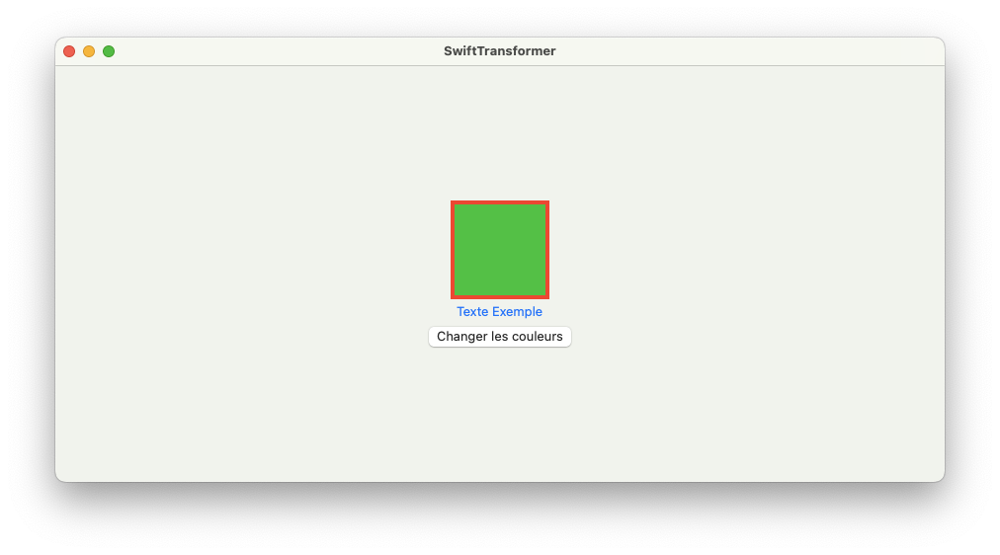
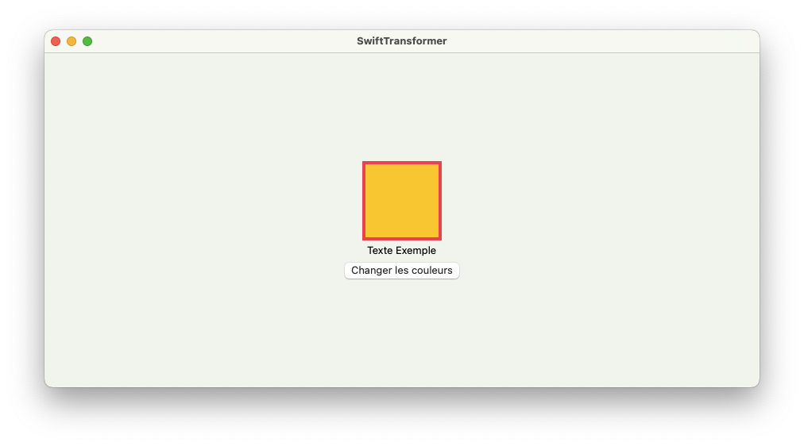

comment enregistrer Color en SwiftData

just understand how ValueTransformer and  @Attribute(.transformable(by: ColorTransformer.self)) work

<em>Init</em>

<em>Init</em>

add

class ColorTransformer: ValueTransformer {
    override func transformedValue(_ value: Any?) -> Any? {
        guard let color = value as? NSColor else { return nil }
        do {
            let data = try NSKeyedArchiver.archivedData(withRootObject: color, requiringSecureCoding: true)
            return data
        } catch {
            print(error.localizedDescription)
            return nil
        }
    }
    
    override func reverseTransformedValue(_ value: Any?) -> Any? {
        guard let data = value as? Data else { return nil }
        do {
            let color = try NSKeyedUnarchiver.unarchivedObject(ofClass: NSColor.self, from: data)
            return color
        } catch {
            print(error.localizedDescription)
            return nil
        }
    }
    
    override class func transformedValueClass() -> AnyClass {
        return NSColor.self
    }
    
    override class func allowsReverseTransformation() -> Bool {
        return true
    }
    
    static func register() {
        ValueTransformer.setValueTransformer(ColorTransformer(), forName: .init("ColorTransformer"))
    }
}

    init() {
        // Enregistrer le ValueTransformer pour la couleur
        ColorTransformer.register()
    }

Model
class MonModele: ObservableObject {
    // Propriétés `Data` pour stocker les couleurs
    @Attribute(.transformable(by: ColorTransformer.self)) var backgroundColor: Color
    @Attribute(.transformable(by: ColorTransformer.self)) var textColor: Color
    @Attribute(.transformable(by: ColorTransformer.self)) var borderColor: Color

    // Initialisateur avec des couleurs par défaut
    init() {
        // Définit des couleurs par défaut au départ
        self.backgroundColor = .green
        self.textColor = .blue
        self.borderColor = .red
    }
}
